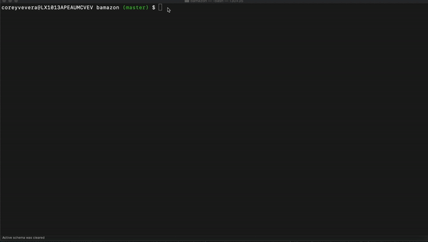
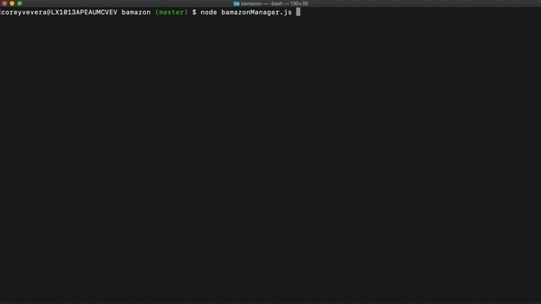

## Our Bamazon App has two sections

## Bamazon Customer

Our Bamazon Customer app allows the user to select a product from our inventory and purchase a specific quanity. If bamazon does not have enough in stock, the user can purchase another product or less of their original choice.

## Bamazon Manager

Our Bamazon Manager app allows the user to view all products, view low inventory prodects, add quanity to an item's stock, and add an entirely new item!

## Overall App Structure
Bamazon is a node.js app that manipulates a database through MySql. The app uses inquirer to get information from the user to manipulate the "bamazon" store as both a customer and a manager.

